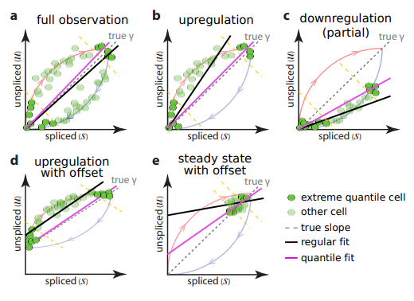
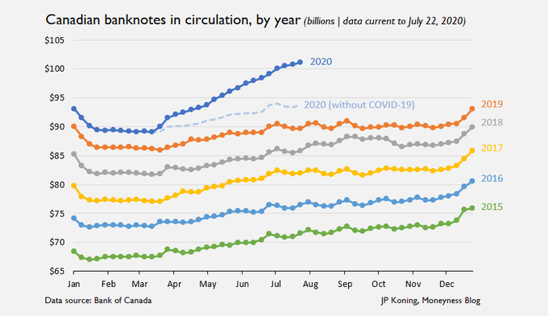
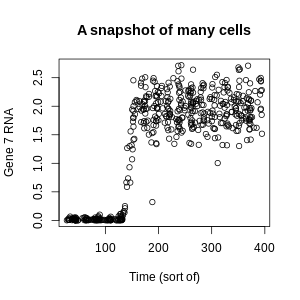
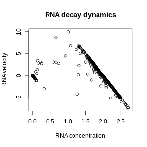

## Outliers

### Background

Contrary to many overzealous ethics sticklers, discarding data that do not fit a trend is [part of normal scientific practice](https://www.pnas.org/content/pnas/86/23/9053.full.pdf) in many cases. The reason is simple: the universe is complicated. The mechanisms producing your data are not always the mechanisms you want to study. In astronomy, this can take the form of [dead pixels or hair and dust on the camera](https://www.eso.org/~ohainaut/ccd/CCD_artifacts.html).

*Dead pixels wipe out a column of a telescope image. Image from [here](https://www.eso.org/~ohainaut/ccd/CCD_artifacts.html).*

In cell biology, a model might assume biochemical reactions have reached a steady state, when in fact they are sometimes in a transient intermediate state. 

*Robust estimation of RNA splicing dynamics from supplemental note 2 of [this](https://www.nature.com/articles/s41586-018-0414-6) awesome paper.*

In economics, the money supply followed predictable yearly bumps and whorls -- until a raging coronavirus pandemic shut down all the shady businesses that mobsters used to launder their wads of cash through.

*Canadian money supply during the early days of the pandemic, from [JP Koning](http://jpkoning.blogspot.com/2020/07/how-pandemic-has-clogged-global-economy.html)*.

In today's session, we will illustrate the principle that sometimes, *an estimator must not respond to outliers*.

### Exercises

1. Generate a random sample of size 1,000 from a Binomial distribution with 100 trials and p=0.5. Use the function `rbinom`. Plot a histogram of the data using `hist`. 
2. Compute the mean, median, and mode of the sample.
3. Find a classmate and ask them to add one outlier to your dataset. Be creative. 
4. Add the outliers to your sample. Compute the mean, median, and mode.
5. Look up the methods for computing the mean, median, and mode. How should they each react to an outlier? How much influence is it given?

### More exercises

The data for the rest of the session comes from some research I've been working on recently. It's from a simulation of a small network of 18 genes that interact with one another. The DNA of each gene is transcribed into RNA, and the RNA is translated into proteins. The rate of transcription of RNA depends on certain protein products from the other genes. The rate of RNA decay is simpler. It is proportional to the amount of RNA present. The production rate minus the decay rate is the total rate of change of the RNA, also called the RNA velocity. The simulation reveals the amount of RNA and the amount of protein. It also reveals the total rate of change of RNA, but without separating production and decay.  

For my research, I needed the production and decay rates separately, not just the total velocity. Let's look at the data to see if there's any hope of teasing them apart. Here's a typical gene from this dataset. Each dot represents the values at the final time-point of a separate run of the simulation. There is some randomness purposefully included. We'll look at three quantities: the time the simulation was terminated; the RNA level of gene 7 at that time; and the rate of change of that RNA level.

A time-series of RNA levels begins at near-zero expression with little variability, and around time-point 150, it rapidly grows to high expression with high variability. A display of RNA concentration and RNA velocity shows two parallel lines with negative slope, one at low RNA levels and the other at high RNA levels, plus some wild outliers, which are mostly in-between.

I chose each chart for a rhetorical reason. 

- The first plot gives us important context about this dataset: it has two steady states, "on" and "off", with some garbage in between. 
- The second plot gives us a key piece of information. Within each steady state, the production rate is probably near-constant, and the velocity decreases linearly with the RNA concentration due to the decay rate.

Determine the constant of proportionality for the decay rate. Email your R code and report to Eric as `LAST_FIRST_outliers.R` and `LAST_FIRST_outliers.docx`.

1. Download the [data](https://github.com/ekernf01/HEART_choosing_stat_methods/blob/main/course%20content/4_outlier_robustness/SyntheticGeneActivityData.csv) and the [starter script](https://github.com/ekernf01/HEART_choosing_stat_methods/blob/main/course%20content/4_outlier_robustness/SyntheticGeneActivityData.R). The columns for genes 7 and its velocity are `x_g7` and `velocity_x_g7`. Reproduce the two plots above. 
2. Add a least-squares line of best fit to the second plot. This is analogous to a sample mean. You can using the R function `lm` to find the slope and intercept, and you can use the `abline` function to add a line with the same slope and intercept to the plot. Observe how truly pathetic it is. Sneer at it. Stop sneering. Move on. 
3. There is another type of line of best fit analogous to the median called *quantile regression*. Add a quantile regression line of best fit. You can use the `quantreg` R package, but you probably will need to install it first.
4. How else could you capture the trend in this dataset? Get creative and come up with a better solution. 
5. Wrap your code in a single function so you can test least-squares, quantile regression, and your solution easily on another gene. Crank out the same plots for genes 1, 5, 16, and 18. Does your solution still work? If not, can you modify it to be more general?

