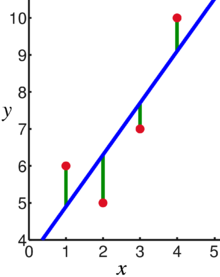
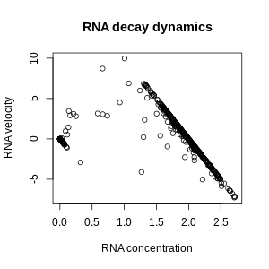

## Being conservative 

When the exact right answer cannot be determined from a dataset, you need to make a choice about what types of errors are most harmful. You often want to be conservative in some sense, but that can take different forms. In particular: 

- You might want to declare that an effect exists only if there is strong evidence for it. 
- You may want to allow for its existence even if the evidence is not very strong. 

You cannot do both of these things. Today, we will get into some of the details and see a version of this tradeoff in action.

### Learning objectives

- Describe linear regression.
- Fit linear regression models in python. Use them to extract predictions and control the rate of false positives.
- Describe two model selection criteria -- hypothesis testing and cross-validation. 
    - Explain the differences between them in terms of end goals and in terms of typical outcomes. 
    - Implement them in python to demonstrate the differences in their results. 

### Linear regression 

Linear regression means fitting a line to a set of data on an X-Y scatterplot. If $Y \approx \beta_0 + \beta_1 X$, the task is to choose the slope $\beta_1$ and the y-intercept $\beta_0$. 

You saw linear regression in the session on outliers. We used it to try to capture the line in this plot, and we tried to modify it to ignore outliers. 

Today we will carry out linear regression using built-in functions in third-party Python packages. These functions choose coefficients by minimizing the sum of squared errors:

$$(Y_1 - \beta_0 + \beta_1 X_1)^2 + ... + (Y_N - \beta_0 + \beta_1 X_N)^2$$
    
.  This is the sum of the squares of the lengths of the *vertical green lines* in the first picture.

### Variable selection

Linear regression is often done using more than one $X$ value for each observation. In those cases, it is harder to picture because the XY scatterplot only fits one variable on the X axis, but the formula is still easy to write: 

$$Y_i \approx \beta_0 + \beta_1 X_{i1} + \beta_2 X_{i2}+ \beta_3 X_{i3}$$
.

Today, we ask: which parts of $X$ should we use and which should we ignore? If the estimated value for $\beta_2$ is small, should we set it to 0 and continue as if $X_{i2}$ has no association with $Y_{i}$? This type of test appears in nearly every public health study in a context where X is something like **"cigarettes per day"** and Y is something like **"age at onset of lung cancer"**. 

This problem is called "variable selection" or "subset selection". Countless papers, several books, and probably hundreds of computer programs have been written on this question, and different methods get different answers. Sometimes, one method is just better than another, but often, the difference is not about performance but rather priorities. In particular, these methods may prioritize either *prediction* or *inference*. 

- Inference means we want to learn something about the internal mechanisms of the system under study: *does smoking cause cancer?*
- Prediction means we don't care if the internals are right or wrong: if someone gives us a new value of $X$, we just want to guess $Y$: *is this patient at high risk of cancer?*

Algorithms or decision rules that are optimized for one of these goals will often fall short of the other goal. In some cases, it is guaranteed that no algorithm can perform optimally at both prediction and inference. [Here](https://academic.oup.com/biomet/article-abstract/92/4/937/389439) is one very technical way of mathematically proving that the prediction-inference tradeoff cannot be avoided. Today, we will demonstrate a similar tradeoff through simulation in Python.

#### Simulated data

Today's demo centers around a dataset generated like this:

- $X_1$ contains the numbers from 1 to 10, with each number occuring 5 times (total length: 50). They are in a random order. 
- $X_2$ and $X_3$ are generated the same way as $X_1$, but the order is different (all three are statistically independent).
- $\epsilon$ is distributed as $Binomial(0.5, 10)$.
- $Y_i = 11*X_{1,i} + 1*X_{2,i} + 0*X_{3,i} + \epsilon_i$.

So, in truth, $Y$ depends on $X_1$ and $X_2$, but not $X_3$. We will act as if we don't know which of the $X$'s is relevant, and we will consider models that include different combinations of $X$'s.

### Variable selection methods

We'll study three methods for variable selection. 

#### Error after fitting

This is a simple method. 

- Fit some models to the dataset.
- For each model, make predictions (we'll call them $\hat Y$).
- Measure the sum of squared errors $(Y_1 - \hat Y_1)^2 + ... + (Y_{50} - \hat Y_{50})^2$. 
- Select the model with the lowest error. 

#### Leave-one-out cross-validation

This works much like the last method. You can follow almost the same steps. The key difference is to *fit* the model and *evaluate* the model on separate subsets of data. You'll fit each model on 49 data points and evaluate on the 50th. You'll repeat this for all 50 data points and average the results. This is demonstrated in the example code. 

#### Hypothesis testing

This method is completely separate from cross-validation: different history, different priorities, different mathematical basis. The goal here is to control the *false positive rate*: "If $\beta_3=0$, then I want less than a 10% chance of including it in my model." 

To achieve this, we need the concept of a *sampling distribution*. Estimates of the $\beta$'s take a simple form, depending on quantities we have already described. If the estimate of $\beta_3$ is called $\hat \beta_3$, there is a function $f$ such that 

$$\hat \beta_3 = f(X_1, X_2, X_3, Y, \epsilon, \beta)$$

. If you take typical college classes in linear algebra and probabilty & statistics, you can learn what $f$ is and where $f$ comes from. Since this class is about "why", not "how", let's assume someone else has done the math and figure out how to use it.

Functions of random variables are also random variables, so $\hat \beta_3$ is itself a random variable. It follows some mathematical law, which we call its *sampling distribution.* It has an expectation, a variance, and a probability mass function. All of them can be computed and evaluated (at least approximately) via existing software. 

This software provides a very simple procedure. It will output a number called a "p-value". If you want to control the false positive rate at 10% for a given decision, then select a variable whenever its p-value is below 0.1. P-values are discussed a little more in a footnote.

### Exercises

Attempt the exercises below and send your results and your code by email as a Python notebook or an HTML file.

Starting from the [linear regression demo](https://github.com/ekernf01/HEART_choosing_stat_methods/blob/main/course%20content/6_be_conservative/linear_regression_demo.py): 

1. Compare these three models:   
    - $Y \approx \beta_1*X_1$,
    - $Y \approx \beta_1*X_1 + \beta_2*X_2$, and
    - $Y \approx \beta_1*X_1 + \beta_2*X_2 + \beta_3*X_3$.

   Compare them using the error after fitting and the error from leave-one-out cross-validation. Generate 1,000 different datasets. What percent of the time is $X_2$ included in the model? $X_3$?
2. Fit the model $Y \approx \beta_1*X_1 + \beta_2*X_2 + \beta_3*X_3$. Test the null hypotheses $\beta_2=0$ and $\beta_3=0$, controlling the false positive rate at 10%. Repeat 1,000 times.

Report your results in a table like this. (These numbers are made-up.)

| Method            |     includes X_2    |  includes X_3 |
|-------------------|:-------------------:|--------------:|
| Fitting error     |  80%                | 10%           |
| LOOCV             |  60%                | 20%           |
| Hypothesis tests  |  40%                | 30%           |

### Footnotes

You don't have to read these. But you can if you want.

#### P-values

A p-value is a probability. The event that this probability describes is a little complicated. Suppose you do an analysis and observe an estimate $\hat \beta_3$. Suppose you were to re-do the entire study, obtaining a new dataset in the exact same way as the first. The p-value associated with $\hat \beta_3$ is the probability of observing a result more extreme than $\hat \beta_3$ upon redoing the study. This probability is defined and calculated only under a strong assumption called a "null hypothesis", to be explained below. 

"More extreme" can be measured in different ways, and when you report a p-value, you need to explain how you measured extremeness. If you hear people talking about "one-tailed" and "two-tailed" tests, they are measuring extremeness in different ways. If all else remains the same, the p-value is always decreasing with the measure of extremeness.

P-values assume a certain "null hypothesis". The same probability calculations cannot apply both when the true value $\beta_3$ is 0 and when $\beta_3$ is 10,000, and in this lecture, the null hypothesis is that the coefficient being tested equals 0. 

In probability and statistics, we are accustomed to probabilities describing random variables, but being fixed themselves. For a Binomial random variable with success probability 0.5, the outcome is random, but the 0.5 is fixed. P-values break this dichotomy: they are stated as probabilities, but they are also outcomes of a random experiment. This can be very confusing. It may be easier at times to retreat from p-values and consider only sampling distributions of more tangible quantities, like $\beta_3$. Often, you can still get the job done without using p-values at all. 

### Prediction and inference within a single research problem

The "prediction versus inference" debate can become more complicated when you use a predictive model as a component of a downstream inference method. You might want to test whether the gene ZBTB4 contributes to younger age at onset of Alzheimer's disease. To reduce randomness in age at onset, you might first subtract out variation due to known causes, like biological sex or the gene APOE4. For testing ZBTB4, the objective is inference, but when modeling known causes, you do not need inferences. You need the best possible predictions. Sometimes you need to add complexity to a *predictive* model in order to achieve the best possible *inferences* further downstream. (This example is from a [2018 paper](https://www.ncbi.nlm.nih.gov/pmc/articles/PMC5902667/) I contributed to in the [lab of Elizabeth Blue](https://www.biostat.washington.edu/people/elizabeth-blue) at the University of Washington.)

